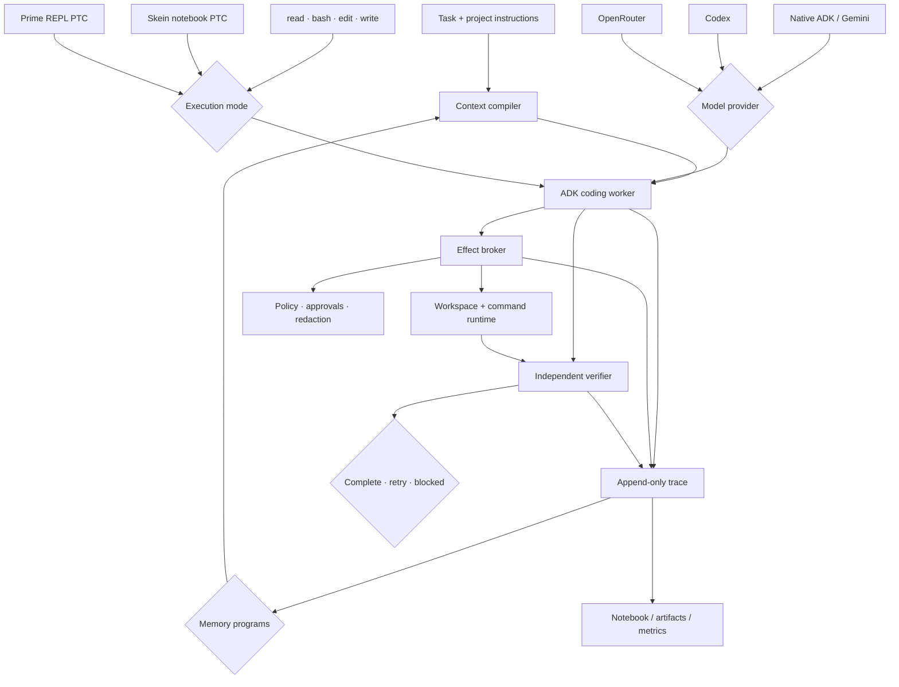

# Skein architecture

Skein is a coding-agent control plane built around one Google ADK worker. The model
chooses tactics; deterministic host code owns context, effects, history, recovery,
budgets, and completion.

## Context compiler

`harness/context` turns the task, repository map, selected skills, recent evidence,
and any compaction handoff into a bounded work packet. Stable instructions and tool
declarations remain byte-stable for provider caching; volatile task state stays in
the dynamic suffix. Context is compiled deterministically so the same inputs and
watermark produce the same bytes.

## Harness factory and ADK worker

`app/agent/factory.py` is the composition boundary. It validates configuration and
wires one ADK worker to a provider, execution mode, context policy, effect broker,
state stores, and verifier. The topology is code-owned: configuration selects known
implementations and budgets but cannot invent tools or bypass safety.

The worker owns the model/tool loop. It may explore, modify code, request checks, or
claim completion. Those are proposals; host state and verification decide what
actually happens next.

## Model providers

`harness/ai` adapts supported providers to one ADK-facing contract. Provider choice,
model name, reasoning effort, and generation limits are configurable. Request-shape
hashing, retry bounds, usage accounting, and secret handling stay consistent so a
provider swap does not change harness authority.

## Execution modes

The compatibility mode exposes `read`, `bash`, `edit`, and `write`. Skein notebook
PTC and Prime PTC expose one programmable `execute_code` tool instead. These modes
change how the model composes work, not what it is allowed to do.

Skein notebook PTC uses a persistent CPython worker and routes nested capabilities
through the same broker as direct tools. Its notebook is a deterministic workbench
projection over trace evidence, not the historical authority. Failed cells discard
their dirty kernel epoch; restoration replays only explicitly safe cells.

Prime PTC supplies an alternative persistent REPL and bounded snapshot policy. Its
native effects are classified explicitly rather than being mistaken for brokered
operations. Both PTC implementations expose the same model-facing tool name.

## Effect broker and runtime

`harness/tools`, `harness/environment`, and `harness/sandbox` form one effect path.
They confine file paths, classify commands, enforce policy and approvals, redact
secrets, bound output, and issue mutation receipts. Direct tools, nested PTC calls,
and verification reuse these primitives so syntax never changes authority.

The runtime is injected at assembly time. Local and isolated workspace adapters may
implement execution, but neither can weaken the broker contract.

## Trace, state, and memory

`harness/state` and `harness/ledger` retain the canonical append-only account of
task events and effects, including failures, timeouts, cancellation, and unknown
outcomes. JSONL is the dependency-free ledger; DuckDB is an optional analytical
implementation. Content-addressed artifacts hold large bodies without inflating
model context.

`harness/memory` contains versioned programs over that evidence. History pages,
counts, retrieval, summaries, and compaction views carry their source watermark and
hash. They advise context selection but do not become a second authority. Notebooks,
indexes, caches, metrics, and live Python values are disposable projections or
runtime state.

## Independent verification

`harness/verification` evaluates the task's acceptance criteria against the actual
workspace and reconciled effect history. A model completion claim is insufficient:
required checks must pass, scope must be respected, and no effect may remain unknown.
The verifier returns the deterministic terminal decision: complete, retry, or
blocked.

## Configuration boundary

Profiles may select a provider, execution mode, ledger implementation, and bounded
context or generation settings. They may not expand the model-visible tool surface,
bypass the effect broker, replace trace authority, weaken independent verification,
or move volatile state into the stable prompt prefix without an explicit measured
ablation.
