# Skein architecture

Skein explores a simple idea: give a capable model one programmable way to act,
retain the evidence of its work, and compute the context it needs from that evidence.
Google ADK supplies model execution and session machinery; Skein supplies the coding
loop, effect boundary, trace, memory programs, and independent completion decision.

The design responds to a basic long-session problem: useful information accumulates
faster than a model can keep it in active context. Repeated tool calls consume turns,
raw results consume tokens, and summaries can erase details needed later. Skein keeps
computation and evidence outside the prompt, then deliberately selects what the model
needs for its next decision.

This creates a deliberate split of authority. The model owns tactics—what to inspect,
compute, change, or try next. Deterministic host code owns authorization, deadlines,
effects, history, recovery, budgets, context construction, and whether the work is
actually complete.

```mermaid
flowchart LR
    subgraph INPUT["① Assemble"]
        direction TB
        TASK["Task + project context"]
        CFG["Validated profile"]
        CTX["Bounded context<br/><small>selected from evidence</small>"]
        TASK --> CTX
        CFG --> CTX
    end

    subgraph CORE["② Reason"]
        direction TB
        MODEL["Model provider<br/><small>Gemini · Codex · OpenRouter</small>"]
        WORKER["ADK coding worker<br/><small>one model/tool loop</small>"]
        MODE["Programmable action surface<br/><small>four tools · Skein notebook PTC</small>"]
        MODEL --> WORKER
        WORKER --> MODE
    end

    subgraph CONTROL["③ Act under host authority"]
        direction TB
        BROKER["Effect broker"]
        POLICY["Policy + approvals<br/><small>confinement · redaction · receipts</small>"]
        RUNTIME["Workspace + command runtime"]
        MODE --> BROKER
        BROKER --> POLICY
        POLICY --> RUNTIME
    end

    subgraph EVIDENCE["④ Record + decide"]
        direction TB
        TRACE[("Canonical evidence<br/>append-only trace")]
        MEMORY["Memory as computation<br/><small>program@version(trace, watermark)</small>"]
        VIEWS["Durable workbench<br/><small>notebook · artifacts · metrics</small>"]
        VERIFY["Independent verifier"]
        RESULT{"Complete · retry · blocked"}
        TRACE --> MEMORY
        TRACE --> VIEWS
        RUNTIME --> VERIFY
        VERIFY --> RESULT
        VERIFY --> TRACE
    end

    CTX --> WORKER
    BROKER --> TRACE
    MEMORY -. "bounded evidence" .-> CTX

    classDef input fill:#eef2ff,stroke:#6366f1,color:#1e1b4b,stroke-width:1.5px;
    classDef core fill:#ecfeff,stroke:#0891b2,color:#164e63,stroke-width:1.5px;
    classDef control fill:#fff7ed,stroke:#ea580c,color:#7c2d12,stroke-width:1.5px;
    classDef evidence fill:#f0fdf4,stroke:#16a34a,color:#14532d,stroke-width:1.5px;
    class TASK,CFG,CTX input;
    class MODEL,WORKER,MODE core;
    class BROKER,POLICY,RUNTIME control;
    class TRACE,MEMORY,VIEWS,VERIFY,RESULT evidence;

    style INPUT fill:#fafafa,stroke:#c7d2fe,stroke-width:1px
    style CORE fill:#fafafa,stroke:#a5f3fc,stroke-width:1px
    style CONTROL fill:#fafafa,stroke:#fed7aa,stroke-width:1px
    style EVIDENCE fill:#fafafa,stroke:#bbf7d0,stroke-width:1px
```



The main loop is intentionally small: assemble bounded context, let one worker reason
and act through one selected interface, record every material attempt, and verify the
result outside the model. The feedback arrow is the long-session mechanism: retained
evidence is transformed into a new bounded view instead of replaying an ever-growing
transcript.

## Context compiler

`harness/context` turns the task, repository map, selected skills, recent evidence,
and any compaction handoff into a bounded work packet. Stable instructions and tool
declarations remain byte-stable for provider caching; volatile task state stays in
the dynamic suffix. Context is compiled deterministically so the same inputs and
watermark produce the same bytes.

This is the central economy of the design. The trace may grow for the life of a task;
the prompt does not. Large bodies remain in artifacts or runtime values, while the
model receives the smallest representation that supports its next judgment.

## Harness factory and ADK worker

`app/agent/factory.py` is the composition boundary. It validates configuration and
wires one ADK worker to a provider, execution mode, context policy, effect broker,
state stores, and verifier. The topology is code-owned: configuration selects known
implementations and budgets but cannot invent tools or bypass safety.

The worker owns the model/tool loop. It may explore, modify code, request checks, or
claim completion. Those are proposals; host state and verification decide what
actually happens next.

## Model providers

`harness/ai` adapts supported providers to one ADK-facing contract. Provider choice,
model name, reasoning effort, and generation limits are configurable. Request-shape
hashing, retry bounds, usage accounting, and secret handling stay consistent so a
provider swap does not change harness authority.

## Execution modes

The target surface is one programmable `execute_code` tool. Code gives the model a
language for mechanical work: a filter, join, loop, or exact condition can be stated
once, executed by the computer, and reduced to the observation that needs judgment.
Intermediate data can remain outside the prompt. This can replace many conversational
tool round trips without asking the model to guess several dependent decisions at
once.

The compatibility mode retains `read`, `bash`, `edit`, and `write` as the measured
baseline. Skein notebook PTC exposes `execute_code`. These modes change
how the model composes work, not what it is allowed to do; all routes meet again at
the same effect boundary.

Skein notebook PTC uses a persistent CPython worker and routes nested capabilities
through the same broker as direct tools. The notebook places exact submitted code,
selected results, narrative, and provenance in one durable working document. It is a
deterministic projection over trace evidence, not the historical authority, and it is
not the live heap. Failed cells discard their dirty kernel epoch; restoration replays
only explicitly safe cells.

## Effect broker and runtime

`harness/tools`, `harness/environment`, and `harness/sandbox` form one effect path.
They confine file paths, classify commands, enforce policy and approvals, redact
secrets, bound output, and issue mutation receipts. Direct tools, nested PTC calls,
and verification reuse these primitives so syntax never changes authority.

The runtime is injected at assembly time. Local and isolated workspace adapters may
implement execution, but neither can weaken the broker contract.

## Trace, state, and memory

`harness/state` and `harness/ledger` retain the canonical append-only account of
task events and effects, including failures, timeouts, cancellation, and unknown
outcomes. JSONL is the dependency-free ledger; DuckDB is an optional analytical
implementation. Content-addressed artifacts hold large bodies without inflating
model context.

Appending rather than rewriting matters: a correction adds evidence instead of
silently replacing the earlier account. The same history can support debugging,
recovery, notebook reconstruction, verification, and several different prompt views.

`harness/memory` treats memory as a view produced by a versioned computation:

```text
view = program@version(authorized evidence at watermark, parameters, budgets)
```

History pages, counts, retrieval, summaries, and compaction views carry their program
identity, evidence addresses, source watermark, parameters, budgets, and result hash.
Deterministic views can be discarded and rebuilt; candidate versions can run against
the same frozen trace before promotion. Model-generated summaries retain inputs and
provenance but remain advisory. Notebooks, indexes, caches, metrics, and live Python
values are projections or runtime state, never competing historical authorities.

## Independent verification

`harness/verification` evaluates the task's acceptance criteria against the actual
workspace and reconciled effect history. A model completion claim is insufficient:
required checks must pass, scope must be respected, and no effect may remain unknown.
The verifier returns the deterministic terminal decision: complete, retry, or
blocked.

## Configuration boundary

Profiles may select a provider, execution mode, ledger implementation, and bounded
context or generation settings. They may not expand the model-visible tool surface,
bypass the effect broker, replace trace authority, weaken independent verification,
or move volatile state into the stable prompt prefix without an explicit measured
ablation.

The companion ADRs turn the thesis into enforceable contracts:

| Decision | Contract |
| --- | --- |
| [Trace-native harness and composable PTC](adr/trace-native-harness.md) | How execution, the notebook document, and runtime-state recovery remain distinct. |
| [Context and memory](adr/context-and-memory.md) | How evidence becomes bounded, versioned, reproducible context. |
| [Execution and recovery](adr/execution-and-recovery.md) | How effects are authorized, interruptions reconciled, and completion verified. |
| [Harness comparison](adr/harness-comparison.md) | How Skein differs from Codex, OpenCode, and Pi, including its novel combination of contracts. |
