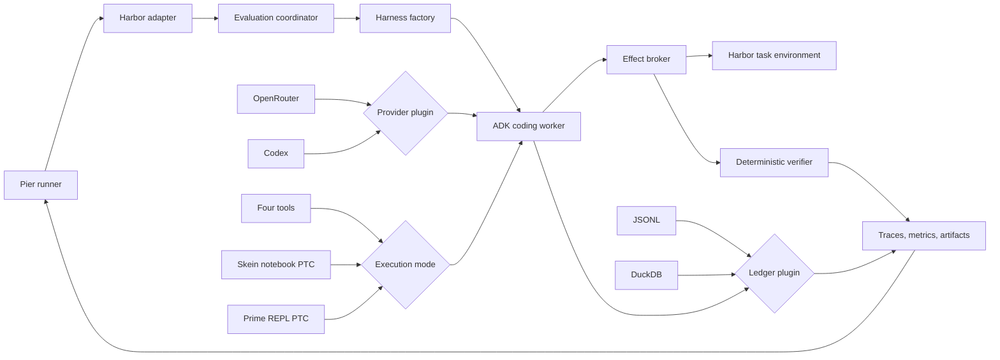

# Skein architecture

Skein is an evaluation harness, not an interactive coding product. Pier owns the
benchmark lifecycle and disposable task environment; Skein owns one bounded model
loop, its effects, evidence, and completion decision.

## Why these boundaries exist

### Pier runner and Harbor adapter

`scripts/run_harbor_eval.py` selects frozen tasks, starts or resumes Pier jobs,
and records task-level results. `harness/evals/harbor.py` translates Skein's file,
shell, repository, and Prime runtime operations into Harbor environment calls. This
keeps credentials and the model loop on the host while every coding effect lands in
the disposable benchmark workspace.

### Evaluation coordinator

`harness/evals/runner.py` prepares an immutable per-trial configuration and invokes
the internal run coordinator. The coordinator exists for deterministic lifecycle,
timeouts, event ordering, and shutdown—not to serve a UI. There is no WebSocket or
terminal layer in the minimal build.

### Harness factory and ADK worker

`app/agent/factory.py` is the composition boundary. It validates the selected YAML,
builds exactly one Google ADK worker, and wires the chosen provider, execution mode,
memory backend, policy, and verifier. Topology stays code-owned so a benchmark flag
cannot silently weaken safety or completion rules.

The worker owns the model/tool loop. Stable instructions and tool declarations form
a cacheable prefix; task state is a bounded dynamic suffix. A model may request
completion, but only the verifier can accept it.

### Provider plugins

`harness/ai` adapts Codex and OpenRouter to ADK's model interface. Provider choice is
configurable because experiments compare fixed model identities, but retries,
reasoning, token accounting, and serialized request identity remain normalized.

### Execution-mode plugins

The default mode exposes `read`, `bash`, `edit`, and `write`. Skein notebook PTC and
Prime PTC instead expose one `execute_code` tool. All three modes reuse the same task,
policy, evidence, and verification contracts; only the model's composition surface
changes. This makes mode comparisons meaningful rather than comparisons of different
harnesses.

### Effect broker and verifier

`harness/environment`, `harness/sandbox`, and `harness/tools` confine paths, classify
commands, redact and bound output, and record mutation receipts. In Pier runs the
broker targets Harbor's environment API. `harness/verification` independently checks
the requested behavior against that same workspace. Unknown effects and missing
evidence fail closed.

### Ledger plugins and artifacts

`harness/state`, `harness/ledger`, `harness/telemetry`, and `harness/tracing` retain
append-only evidence. JSONL is the dependency-free canonical option; DuckDB is the
optional analytical backend. Notebooks and Prime snapshots are projections or runtime
state, never competing historical authorities. Pier receives the final result plus
paths to the preserved evidence.

## Configuration rule

Profiles may select a provider, execution mode, and ledger backend. They may tune
bounded generation and context settings. They may not add model-visible tools, bypass
the effect broker, replace deterministic verification, or move volatile task state
into the stable instruction prefix without a measured ablation.
